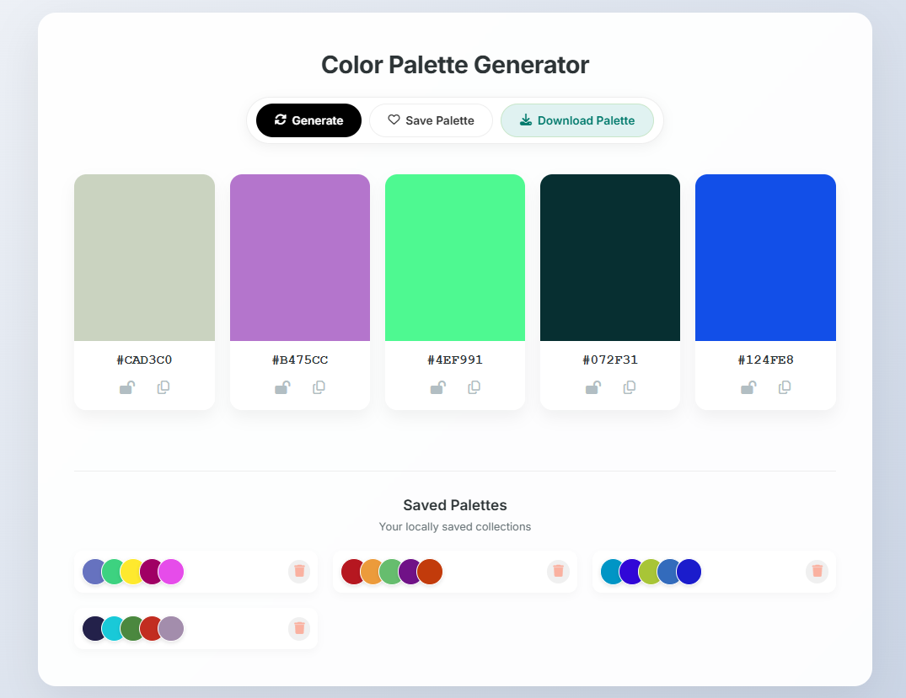

# 🎨 Glassmorphism Color Palette Generator

A modern, aesthetic web application that generates harmonious color palettes. Built with Vanilla JavaScript, it features a premium "frosted glass" UI, local storage persistence, and image export functionality.



## 🚀 Live Demo

**[View Live Demo Here](#)** _(Replace this with your GitHub Pages or Netlify link)_

---

## ✨ Key Features

- **🎲 Instant Generation:** Press `Spacebar` or click "Generate" to create unique color combinations instantly.
- **🔒 Smart Locking:** Click the "Lock" icon to freeze colors you love while regenerating the rest.
- **💾 Local Library:** Save your favorite palettes. They are stored in your browser's **Local Storage**, so they won't disappear when you refresh.
- **📋 One-Click Copy:** Click any Hex code to copy it to your clipboard.
- **📸 Export as Image:** Download your palette as a high-quality `.PNG` file to share with clients or use in design tools.
- **💎 Premium UI:** Features a modern "Glassmorphism" design with animated mesh gradients, backdrop blurs, and 3D tilt effects.
- **📱 Fully Responsive:** Works seamlessly on desktops, tablets, and mobile phones.

---

## 🛠️ Tech Stack

- **HTML5** - Semantic structure.
- **CSS3** - Advanced styling including:
  - CSS Grid & Flexbox layouts.
  - `backdrop-filter` for glass effects.
  - CSS Animations (`@keyframes`) for the moving background.
- **JavaScript (ES6+)** - DOM manipulation, event delegation, and state management.
- **External Libraries:**
  - [html2canvas](https://html2canvas.hertzen.com/) - Used for the "Download as Image" feature.
  - [Google Fonts](https://fonts.google.com/) - _Poppins_ (UI) and _JetBrains Mono_ (Code).

---

## 🏃‍♂️ How to Run Locally

Since this project uses Vanilla JS, you don't need to install Node.js or any complex dependencies.

1.  **Clone the repository:**
    ```bash
    git clone [https://github.com/sarasithagalagama/color-palette-generator.git](https://github.com/sarasithagalagama/color-palette-generator.git)
    ```
2.  **Navigate to the project folder:**
    ```bash
    cd color-palette-generator
    ```
3.  **Open `index.html`:**
    - Simply double-click `index.html` to open it in your browser.
    - _Optional (Recommended):_ Use the "Live Server" extension in VS Code for the best experience.

---

## 🎮 How to Use

1.  **Generate:** Press the **Spacebar** or click the **Generate** button.
2.  **Lock:** Click the **Unlock icon** 🔓 on a color card to lock it 🔒.
3.  **Copy:** Click the **Hex Code** (e.g., `#F43B21`) to copy it.
4.  **Save:** Click **Save Palette** to add it to your library at the bottom.
5.  **Download:** Click **Download Palette** to save a `.png` image of your current colors.

---

## 🔮 Future Improvements

- [ ] Add drag-and-drop functionality to reorder colors.
- [ ] Add a "Dark Mode" toggle (although the current glass UI is designed to be hybrid).
- [ ] Implement color theory algorithms (Complementary, Triadic, Analogous) instead of pure random generation.

---

Made with ❤️ by Sarasitha
